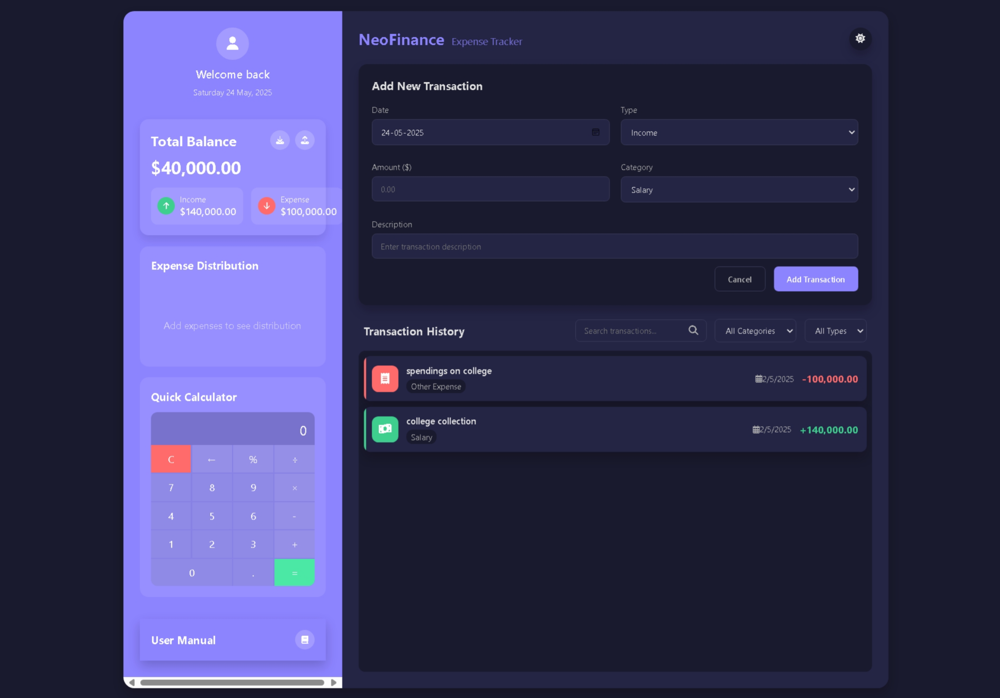

# NeoFinance Expense Tracker

**NeoFinance Expense Tracker** is a modern, user-friendly web application designed to help you efficiently track your income and expenses. It offers detailed transaction management, a beautiful and responsive UI, and a dynamic monthly income & expense trend chart.

---

## Features

- **Add, Edit, and Delete Transactions:** Easily manage your income and expenses with intuitive forms and modals.
- **Dynamic Categories:** Categories update based on transaction type (income or expense).
- **Transaction Filtering and Sorting:** Sort transactions by date, amount, or category for better overview.
- **LocalStorage Persistence:** Transactions are saved in the browser for persistent data storage.
- **Import and Export:** Export transactions as JSON files or import from valid JSON backups.
- **Income & Expense Trend Chart:** Visualize your monthly income and expenses with a modern, interactive Chart.js bar chart (with tooltips and color-coded bars).
- **Fully Responsive & Mobile-First:** All panels, forms, lists, modals, calculator, and charts are fluid, touch-friendly, and usable on any screen size.
- **Modern Theme-Only Buttons:** All buttons use only theme colors with gradients and strong hover/active effects (no white/glassy styles).
- **Footer Always Visible:** Footer never obscures content; last transaction is always visible above the footer.
- **Enhanced Modal UX:** Edit and calculator modals close on overlay click or X button; Escape key also closes modals.
- **Keyboard Accessibility:** Use keyboard shortcuts like Escape to close modals and Enter to submit forms.
- **Currency Formatting:** Automatic locale-based currency formatting.
- **Mock Cloud Backup:** Simulated cloud backup every 5 minutes to prevent data loss.

---

## Usage

1. **Adding a Transaction:**
   - Fill in the date, type (income or expense), amount, category, and description.
   - Click submit to add the transaction.

2. **Editing a Transaction:**
   - Click the edit button next to a transaction.
   - Modify the details in the modal that appears.
   - Save changes or delete the transaction.

3. **Importing Transactions:**
   - Use the file input to upload a `.json` file exported from the app.
   - The app merges valid transactions avoiding duplicates.

4. **Exporting Transactions:**
   - Click the export button to download all transactions as a `.json` file.

5. **Viewing Income & Expense Trend:**
   - Click the "View Income & Expense Trend" button to open a modal with a Chart.js bar chart of monthly income and expenses.
   - Hover/tap bars for tooltips. Chart is fully responsive and color-coded.

6. **Calculator:**
   - Use the built-in basic calculator for quick calculations. Opens in a modal, closes on overlay or X.

7. **Keyboard Shortcuts:**
   - Press `Escape` to close modals.
   - Press `Enter` to submit forms when focused inside form fields.

---

## Installation

No installation needed — just open `index.html` in any modern browser.

---

## File Structure

- **index.html** — Main HTML structure and elements.
- **styles.css** — Modern, mobile-first styles including variables, layout, animations, and advanced responsiveness.
- **script.js** — JavaScript logic handling transactions, UI updates, validation, notifications, modal logic, calculator, and trend chart rendering.

---

## Technical Details

- Uses **CSS Custom Properties** (`--chart-colors`, `--income-color`, `--expense-color`, etc.) for theming and chart color management.
- Utilizes **LocalStorage** for persistent transaction storage.
- Implements **FileReader API** for importing JSON files.
- Uses **Blob API** and download links for exporting data.
- Uses **Chart.js v4** for the income & expense trend chart (all other chart code removed).
- All scientific/memory calculator and old chart code has been removed for simplicity and performance.
- Provides real-time input validation with visual feedback.
- Enhanced modal logic: modals close on overlay click, X button, or Escape key.
- Footer is always visible and never overlaps content, even on mobile.
- All buttons use only theme colors (no white/glassy styles).

---

## Troubleshooting

- **Trend Chart Not Displaying:** Ensure you have at least one income or expense transaction for the selected year. The chart modal requires valid data to render.
- **Footer Overlaps Content:** If you see the footer covering the last transaction, try resizing the window or refreshing. The app adds extra padding to keep content visible.
- **Calculator/Modal Won't Close:** Click the overlay area or the X button, or press Escape. If issues persist, check for browser extensions interfering with modals.
- **Data Not Saving:** Make sure your browser allows LocalStorage. Private/incognito modes may restrict saving.

---

## Contribution

Feel free to fork the repository and submit pull requests with improvements or bug fixes.

---

## License

MIT License — free to use and modify.

---

## Author

NeoFinance Development Team

## Preview

